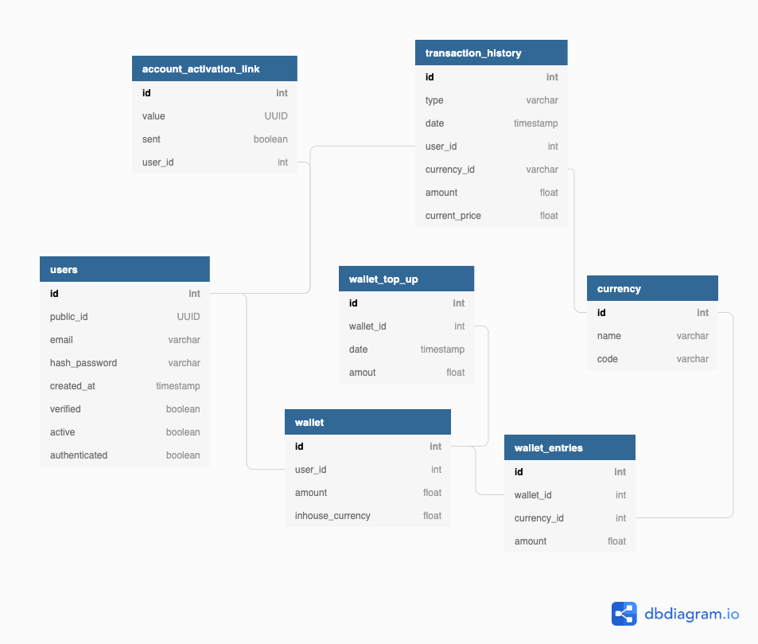

# Silver Parakeet


### Projekt zaliczeniowy przedmiot Inżyniera Oprogramowania

### Opis
Głównym celem aplikacji jest umożliwienie użytkownikowi handlu krypto walutami. Silver Parakeet korzystając z zewnętrznych serwisów będzie przedstawiać zestawianie danych poświęconych kursom za ostatni miesiąc w formie dogodnych wykresów. Aby można było korzystać z aplikacji, użytkownik będzie musiał stworzyć konto, które powiązane będzie z portfelem, który przechowywać będzie zasoby. Bazując na przeprowadzonych zakupach użytkownik będzie miał dostęp do rankingu swoich inwestycji.  

### Zespół:
- [Szymon Błaszczyk](https://github.com/gaser3)
- [Artur Nagrodzki](https://github.com/ArturNagrodzki)
- [Mateusz Nowak](https://github.com/NovakMateusz)

### Technologie:
- Python 3.9 / 3.7
- HTML
- CSS
- JavaScript
- Docker
- SQLite

### Diagram bazy danych


### Zmienne środowiskowe
| Nazwa                   | Wartość domyślna                  | Opis                                                        | Komponent   |
|-------------------------|-----------------------------------|-------------------------------------------------------------|-------------|
| API_KEY                 | Brak                              | Klucz do komunikacji z REST API                             | Main / REST |
| EXTERNAL_RESOURCES_KEY  | Brak                              | Klucz do komunikacji z zewnętrzynym REST API                | REST        |
| EXTERNAL_RESOURCES_URL  | https://www.alphavantage.co/query | URL do zewnętrznego REST API                                | REST        |
| SECRET_KEY              | DevelopmentKey                    | Klucz zabezpieczajacy sesje klienta                         | Main        |
| SQLALCHEMY_DATABASE_URI | sqlite:///SilverParakeet.sqlite   | Ścieżka do bazy danych                                      | Main        |
| MAIL_SERVER             | smtp.gmail.com                    | Adres serwera SMTP                                          | Main        |
| MAIL_PORT               | 465                               | Port serwera SMTP                                           | Main        |
| MAIL_USE_SSL            | True                              | Wykorzystanie enkrypcji SSL                                 | Main        |
| MAIL_USERNAME           | Brak                              | Nazwa użytkownika wysyłajacego wiadomość                    | Main        |
| MAIL_PASSWORD           | Brak                              | Hasło użytkownika wysyłającego wiadomość                    | Main        |
| DROPBOX_API_KEY*        | Brak                              | Klucz do komunikacji z API Dropbox'a                        | REST        |
| MODELS_HASH             | Brak                              | Unikalna nazwa paczki z modelami                            | REST        |
| MODELS_DIRECTORY        | /forecastingModels                | Ścieżka do Dropbox'a, gdzie można znaleźć paczkę z modelami | REST        |

*Token nie jest trwały i ulega przedawnieniu, dlatego przez uruchomieniem aplikacji należy pobrać nowy ze strony [https://www.dropbox.com/developers/](https://www.dropbox.com/developers/)

### Jak uruchomić
#### 1. Przy wykorzystaniu Docker  
Wymagania wstępne:
- Zainstaluj oprogramowanie [Docker Desktop](https://docs.docker.com/desktop/)

1. Z głównego folderu przejdź do cryptoMainApp i zbuduj obraz
```console  
docker build -t crypto-main:latest . 
```
2. Z głównego folderu przejdź do cryptoRESTApi i zbuduj obraz
```console
docker build -t crypto-rest:latest .
```
3. Będąc w głównym folderze uruchom zbudowane obrazy (pamiętaj o uzupełnieniu zmiennych środowiskowych)
```console
docker-compose up -d
```

#### 2. Przy wykorzystaniu Python  
Wymagania wstępne:
- Zainstaluj [Python](https://www.python.org/downloads/) w wersji <= 3.9

TO DO